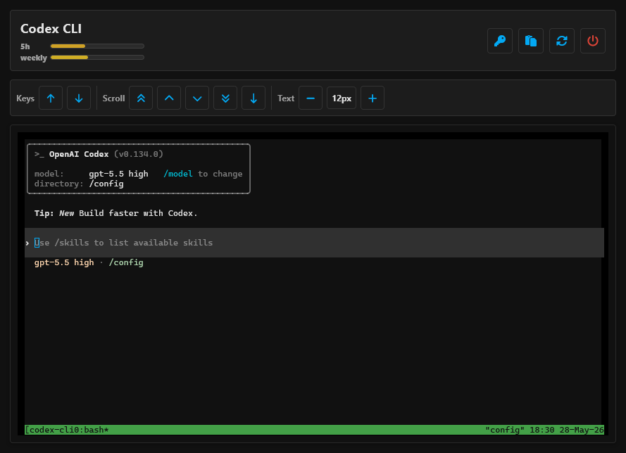

# Codex CLI for Home Assistant

Home Assistant add-on repository for running OpenAI Codex CLI from an ingress panel.



## Installation

Click the button below to add this repository to Home Assistant:

[](https://my.home-assistant.io/redirect/supervisor_add_addon_repository/?repository_url=https%3A%2F%2Fgithub.com%2Fnpinter%2Fcodex-cli-ha)

Or add it manually:

1. In Home Assistant, go to Settings -> Add-ons -> Add-on Store.
2. Open the three-dot menu, then Repositories.
3. Add this repository URL: `https://github.com/npinter/codex-cli-ha`.
4. Install the `Codex CLI` add-on.

## What This Add-On Provides

- Persistent browser terminal backed by `tmux`.
- Codex CLI installed during the Docker build.
- Native browser image upload, paste, and drop support with a small preview panel.
- Pasted images are saved under `/tmp/codex-images-tmp` and cleaned up after `Insert Path`.
- The terminal page inserts the saved image path with `Insert Path`, or directly from `Alt+V` when browser clipboard access is allowed.
- `auth.json` upload helper for copying an existing Codex login into the add-on.
- Header actions for remaining Codex rate-limit bars, image upload, Home Assistant YAML reload, and Home Assistant restart.
- Mobile-friendly terminal controls for text size, arrow up/down keys, and tmux-backed page/line scrollback.
- Companion-app input bar that sends complete command lines without mobile keyboard suggestions leaking into xterm.
- Docker build installs Codex CLI with `npm install -g @openai/codex`.

## Image Paste

Paste or drop an image anywhere on the Codex CLI panel. The add-on captures the browser paste event before xterm, saves the image inside the container, and opens a small preview panel. Press `Insert Path` to place the saved image path into Codex.

The paste icon opens an image upload dialog that works in browsers and the Home Assistant companion app.

`Alt+V` uses the browser Clipboard API when available and then inserts the image path directly. If the browser blocks clipboard reads, use `Alt+V -> Ctrl+V -> Insert Path`.

## Authentication

The panel includes an `auth.json` upload helper. On a logged-in device, Codex usually stores this file at:

```text
~/.codex/auth.json
```

The add-on stores the uploaded file at:

```text
/data/home/.codex/auth.json
```

Uploading `auth.json` restarts the persistent terminal session so Codex picks up the new credentials.

The upload uses a multipart file body, with the older base64 JSON path retained as a fallback.

You can also use an API key in the add-on configuration.

## Home Assistant Actions

`Reload YAML` calls Home Assistant's `homeassistant.reload_all` action through the Supervisor proxy. `Restart HA` restarts Home Assistant Core through the Supervisor API. The header shows remaining 5h and weekly Codex limits as compact color-coded bars.

## Credits

Codex icon source: [Lobe Icons](https://github.com/lobehub/lobe-icons/blob/master/packages/static-png/dark/codex.png).
